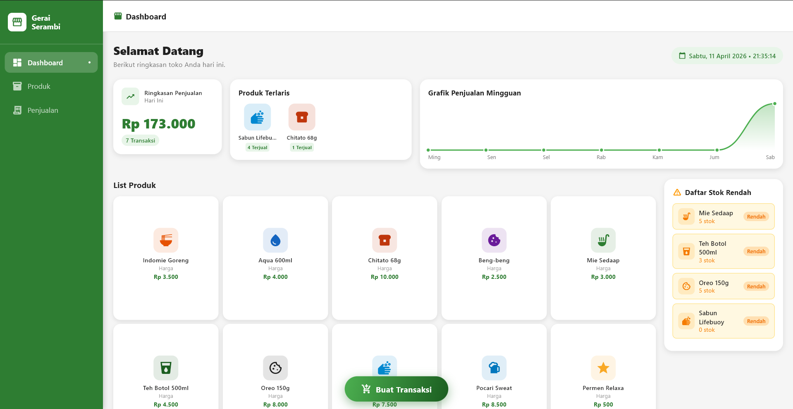
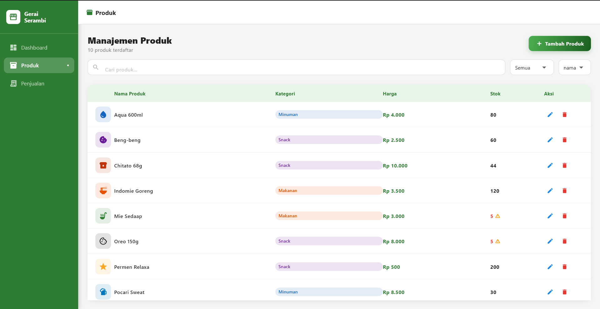
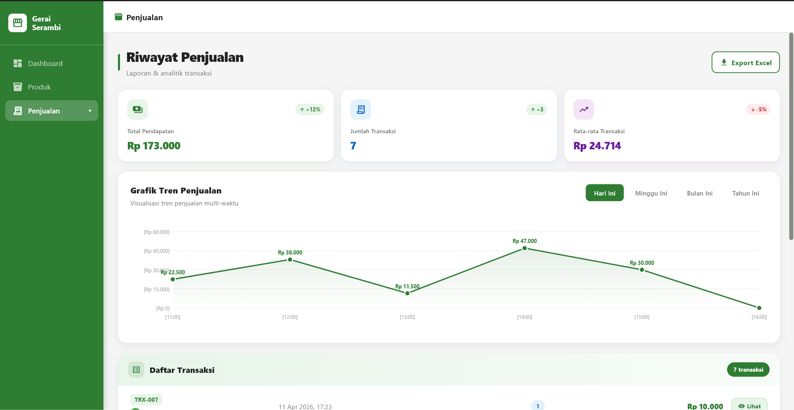
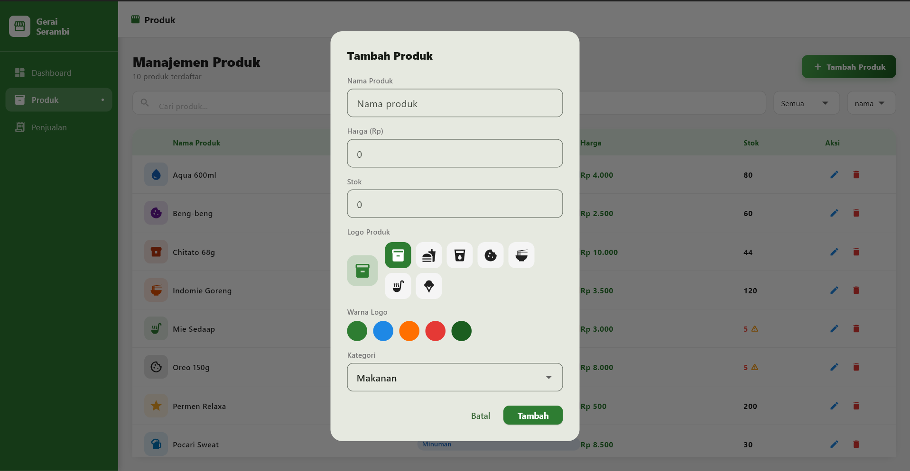
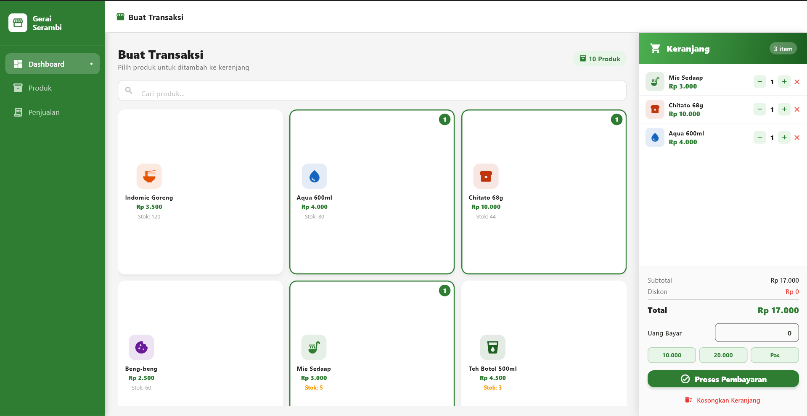
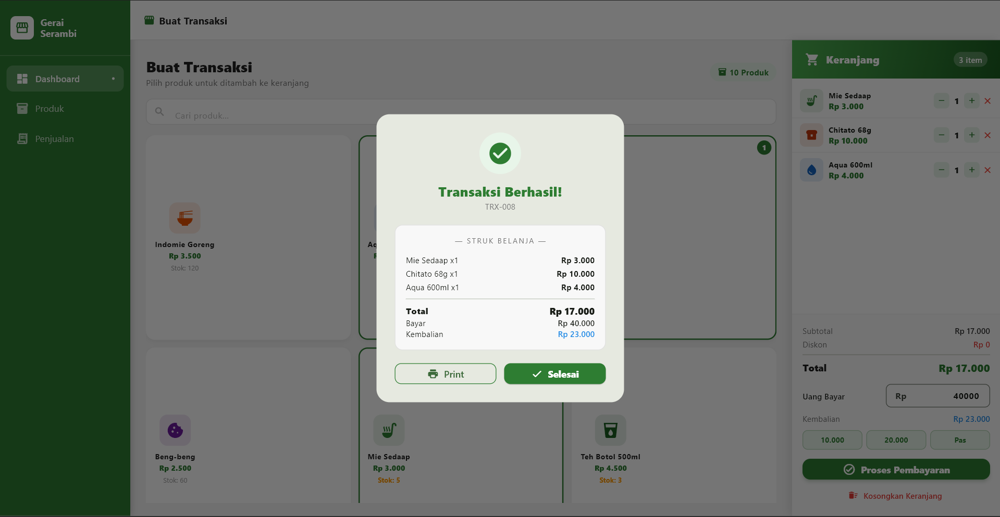

# aplikasi_pendataan

## Fitur Aplikasi
- Pendataan produk
- riwayat pejualan produk
- fitur transaksi
- daftar stock rendah
- grafik penjualan perhari, minggu, bulan dan tahun
- CRUD produk
- export laporan excel 

## Cara Instalasi
- Copy link "https://github.com/RAzuken07/Aplikasi-Pendataan-Toko.git"
- flutter pub get
- flutter run -d Windows

## Tampilan UI/UX

